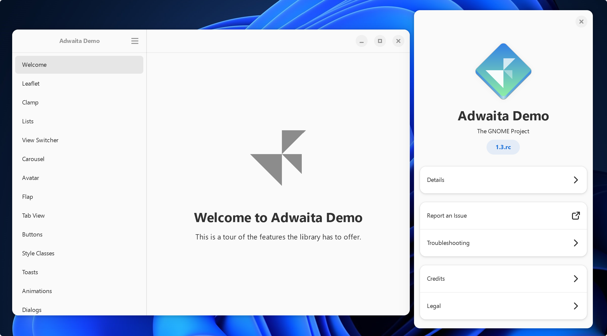

# C++ binding libraries for the GNOME ecosystem

C++ binding libraries for the GNOME ecosystem, maintained and packaged for easy consumption in [build2](https://build2.org) projects.

> **Warning**
>
> The libraries has been tailored to meet our personal needs, and includes some unique modifications that you won't find in their upstream counter-part. Please use this repository at your own risk and make sure to thoroughly test any modifications before incorporating them into your own projects.

## Releases

This repository uses [Semantic Versioning](https://semver.org/) for its releases. You can find the latest release, as well as all previous releases, on the [Releases page](https://github.com/wroyca/mm/release) page.

## Building

> **Note**
> Libmm is designed as a wrapper library, which means that it is assumed that the required GNOME libraries have been installed. These libraries include:
>
> * cairo
> * gdk-pixbuf-2.0
> * gio-2.0
> * gio-unix-2.0
> * glib-2.0
> * gmodule-2.0
> * gobject-2.0
> * gtk4
> * pango
> * pangocairo
> * sigc++-3.0

To build the packages, simply run the following command:

* `bdep init -C @build cc && b`

You can choose a different compiler using the config.cxx option:

* `bdep init -C @msvc cc config.cxx=cl && b`
* `bdep init -C @gcc cc config.cxx=g++ && b`

To build with debugging symbols, add the appropriate flags:

MSVC:
* `b config.cc.coptions="/Od /MDd /Zi" config.cc.loptions=/DEBUG`

GCC / CLANG:
* `b config.cc.coptions=-g`

###### For instructions on installing the build2 toolchain and setting up your environment, please refer to the build2 documentation.

## Installing

To install the packages, use the following command:

`b install`

This will install the packages to the default prefix of the build2 build system (usually /usr/local). You can specify a different prefix using the config.install.root or !config.install.root option:

`b install !config.install.root=/libmm/`

## Credits
The libraries in this repository are based on the work of the GNOME project, which provides C++ bindings for many of its core libraries. These bindings have been modified and packaged for use in build2 projects by the contributors of this repository.

Special thanks to the following individuals for their contributions to this repository:

* Kjell Ahlstedt
* Roger Ferrer Ibáñez
* Murray Cumming
* Daniel Elstner
* Karl Nelson
* Tero Pulkkinen
* Elliot Lee
* Phil Dawes
* Erik Andersen
* Bibek Sahu
* Mirko Streckenbach
* Havoc Pennington
* Guillaume Laurent
* Todd Dukes
* Peter Lerner
* Herbert Valerio Riedel

And many others who have contributed in various ways to make GTKMM a robust and powerful GUI programming library for C++.

We also want to thank the GNOME community for their continued development and support of these essential libraries. Without their hard work and dedication, this project would not be possible.

## License

The repository acts as a packaging and distribution platform for the GNOME C++ binding libraries. The libraries themselves are subject to their own individual licenses, and any modifications made to the libraries in this repository are still bound by the terms of their original licenses. This repository simply provides a convenient way to distribute and manage the libraries within build2 projects, while still respecting the licenses of the individual libraries.

* [libmm-adw](libmm-cairo/LICENSE.md)
* [libmm-cairo](libmm-cairo/LICENSE.md)
* [libmm-gdk](libmm-gdk/LICENSE.md)
* [libmm-gio](libmm-gio/LICENSE.md)
* [libmm-glib](libmm-glib/LICENSE.md)
* [libmm-gtk](libmm-gtk/LICENSE.md)
* [libmm-pango](libmm-pango/LICENSE.md)
