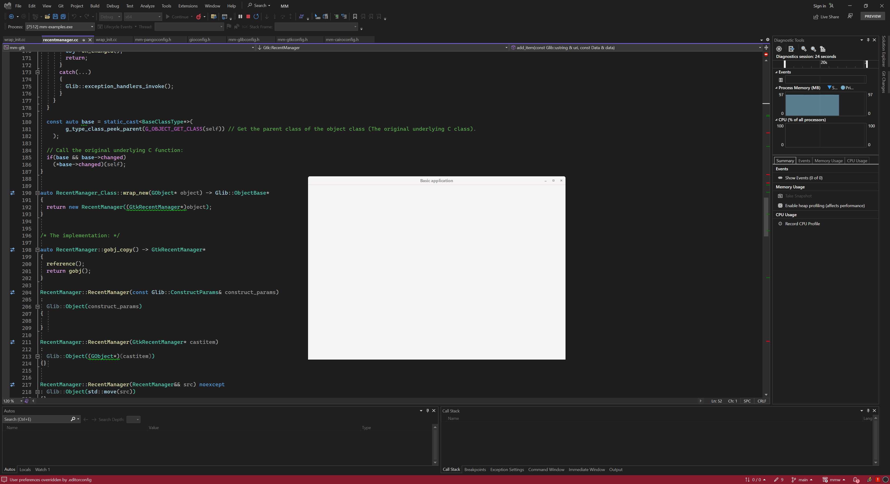

# MM

Monolithic C++ interface for GTK and GNOME, forked from GTKMM.



## Build

### CMake

```bash
cmake -S . -B build
cmake --build build
```

## Documentation
The [documentation]() is generated from the repository source codes directly. It contains all necessary resources including source code snippets, details on execution of the programs, diagrammatic representation of program flow, and links to external resources.

## Legal
MM Libraries are licensed under the terms of their original authors.

* [mm-cairo](mm/cairo/LICENSE.md)
* [mm-gdk](mm/gdk/LICENSE.md)
* [mm-gio](mm/gio/LICENSE.md)
* [mm-glib](mm/glib/LICENSE.md)
* [mm-gtk](mm/gtk/LICENSE.md)
* [mm-pango](mm/pango/LICENSE.md)
